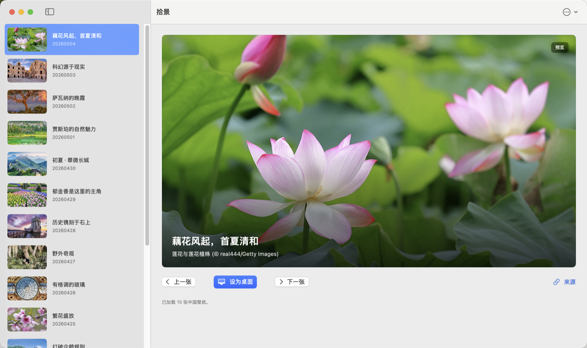
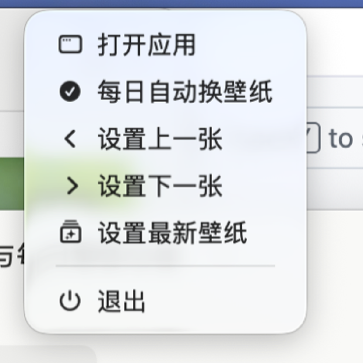

# ScenePick / 拾景

把 Bing 每日壁纸收进菜单栏。想看图时打开，想换桌面时点一下；平时它安静待在状态栏里，不占 Dock，不打扰。

<p>
  
  
</p>

## 它适合谁

ScenePick 适合想让桌面每天有点变化，但又不想被一个完整图片管理器打扰的人。

你可以把它当成一个很轻的壁纸遥控器：浏览最近的 Bing 每日壁纸，预览画面，选择地区和画质，然后把喜欢的那一张设为桌面。菜单栏里也可以直接设置上一张、下一张或最新壁纸。

## 亮点

- 状态栏常驻，不显示 Dock 图标。
- 支持中国、美国、日本、英国、德国、法国、加拿大、澳大利亚等地区。
- 支持 UHD 4K、HD 1080p 和预览图 1366x768 质量。
- 支持填满屏幕或适合屏幕。
- 缓存预览图和已下载壁纸，切换更快。
- 可开启“每日自动换壁纸”。
- 支持中文和英文界面。

## 安装

推荐使用 Homebrew：

```bash
brew tap lishouxian/tap
brew install --cask scene-pick
```

更新或卸载：

```bash
brew upgrade --cask scene-pick
brew uninstall --cask scene-pick
```

安装后打开 `ScenePick.app`，右上角菜单栏会出现拾景图标。点击图标可以打开应用、切换上一张/下一张、设置最新壁纸，或开启每日自动换壁纸。

## 如果 macOS 提示无法打开

当前公开版本使用 ad-hoc 签名。Homebrew 安装会自动处理 quarantine；如果你手动下载或复制应用后遇到“无法打开”，可以执行：

```bash
xattr -dr com.apple.quarantine /Applications/ScenePick.app
```

然后重新打开应用。

## 可选：下载 DMG

也可以从 [GitHub Releases](https://github.com/lishouxian/ScenePick/releases/latest) 下载 `ScenePick.dmg`，打开后把 `ScenePick.app` 拖到 `Applications`。

如果 DMG 安装后仍被系统拦截，同样执行上面的 `xattr` 命令。
